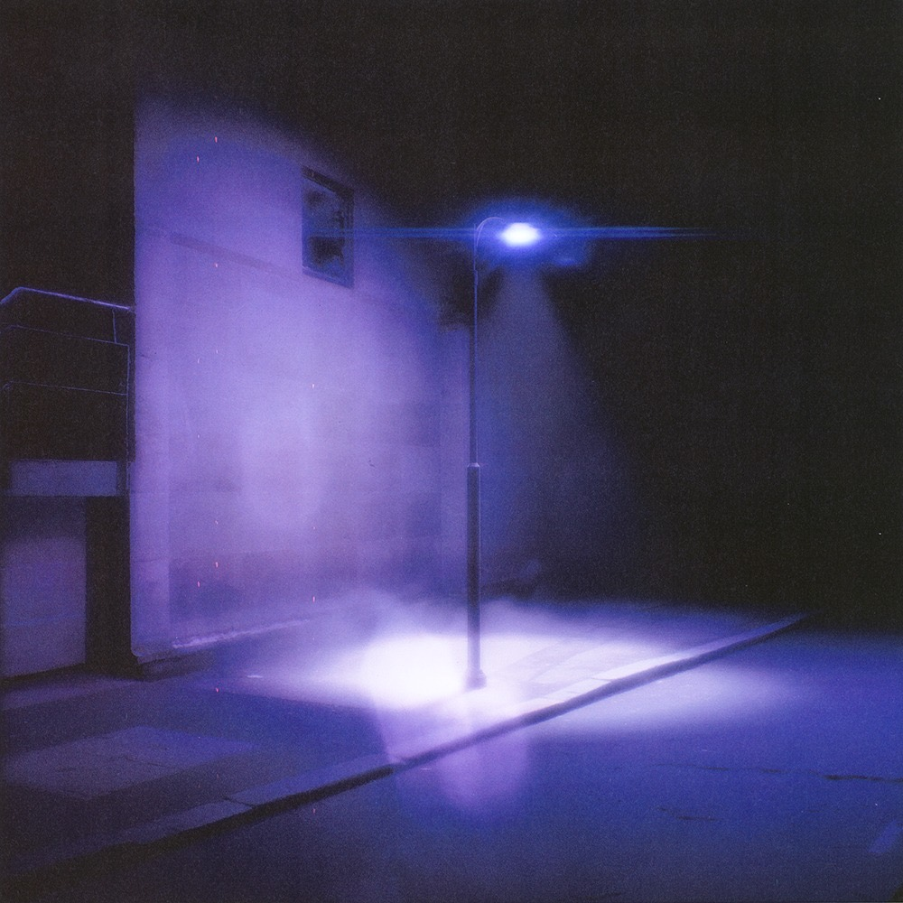

# Partial Defrag: Memory Recoil EP (DL + CD)

Streaming & Download link for *Memory Recoil* on STRATA, for radio / press / personal enjoyment:

[Private Streaming Link](https://on.soundcloud.com/hJo3tjbgKlbsYyC57F)

<iframe
  width="100%"
  height="250"
  scrolling="no"
  frameborder="no"
  allow="autoplay"
  src="https://w.soundcloud.com/player/?url=https%3A//api.soundcloud.com/playlists/soundcloud%3Aplaylists%3A2105745531%3Fsecret_token%3Ds-mb4T0SjZqft&color=%23312b3f&auto_play=false&hide_related=false&show_comments=true&show_user=true&show_reposts=false&show_teaser=true">
</iframe>

  <a href="https://soundcloud.com/strata-edition" title="STRATA" target="_blank" style="color: #cccccc; text-decoration: none;">STRATA</a> · 
  <a href="https://soundcloud.com/strata-edition/sets/memory-recoil/s-mb4T0SjZqft" title="Memory Recoil" target="_blank" style="color: #cccccc; text-decoration: none;">Memory Recoil</a>

[Private Download Link (WAV/FLAC/MP3)](https://drive.google.com/drive/folders/16noqMvtTAGF2rTSexMFTnEJdmYyMf9vQ?usp=sharing)
 
### Release Date: 4.12.2025 (Bandcamp, NINA Protocol)
 

---
 
  
After a critically acclaimed debut release featured in [The Quietus](https://thequietus.com/quietus-reviews/partial-defrag-scandisk-review/), and selected as a [NINA Staff Pick](https://www.ninaprotocol.com/articles/partial-defrag-scandisk), Partial Defrag returns to STRATA with *Memory Recoil*. Shifting from swirling sound design to teetering piano motifs, Memory Recoil ventures deeper into the heart of the hard drive, where the haunted remnants of compressed data are mechanically recombined into uncanny, heartfelt confabulations.

 

 

---
  

## ■ Release Format
Digital + CD (*30-copies limited edition CDs in blue flip-cases with blue vynil cover packaged in antistatic bags*).
 

 

 

## ■ Tracklist
1. Optical Eraser
2. Non-Recoverable Read Errors
3. Bad Sectors
4. Memory Recoil

 
  
## ■ Credits
Written and Produced: **Partial Defrag**
Mixing & Mastering: **Pietro Bardini**
Cover Design: **Partial Defrag**
 
  
## ■ Artist Bio
*"In the empty space of a semi-compressed hard drive"*.

 

For all enquiries, please contact: **strata.edition@gmail.com**

 
 

